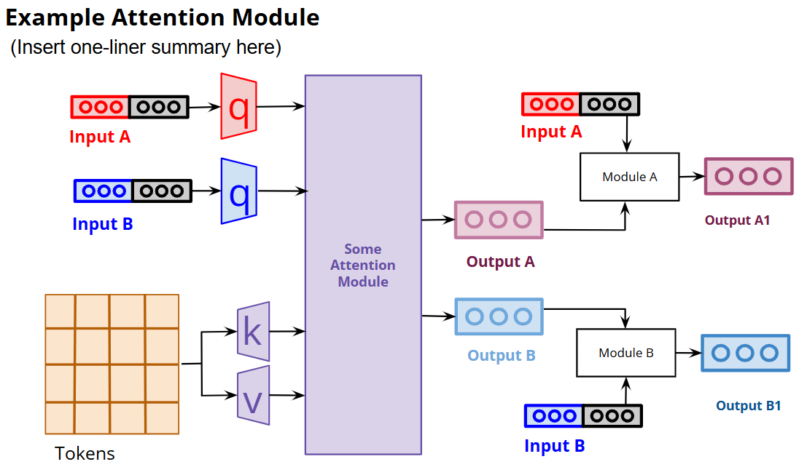
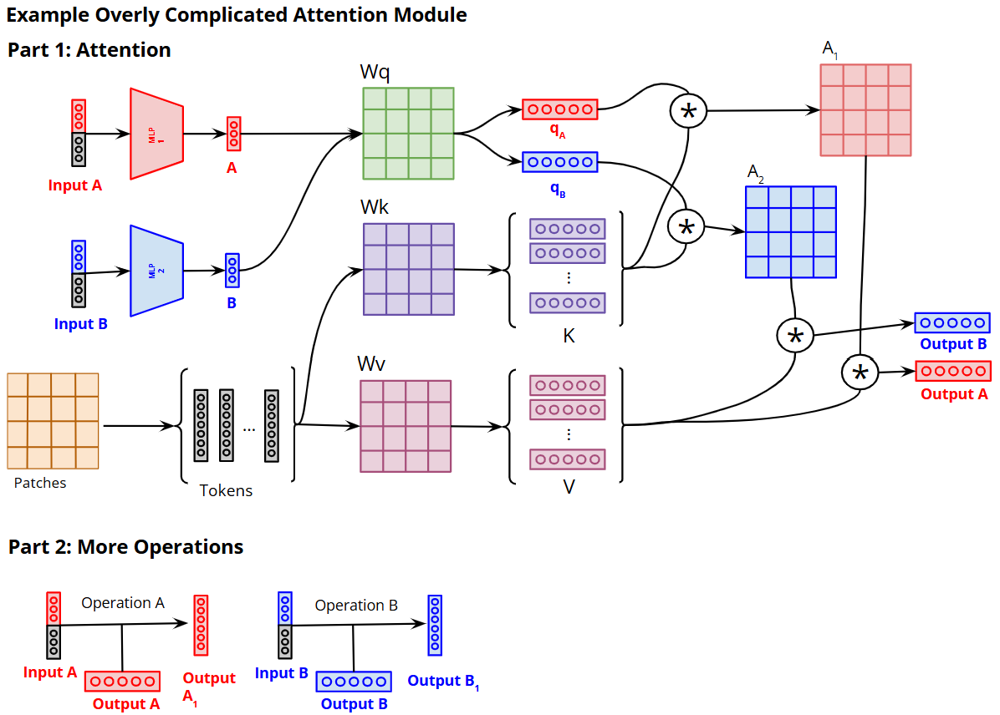

# Introduction

Diagrams are really important. A good diagram quickly conveys the high-level idea of your approach to readers before they dig deep into the methodology of the paper. When people read your paper, they will usually look at your abstract, introduction, tables, and your main diagram before they dig deeper into the details of your methodology.

Diagramming style heavily depends on the venue that you try to publish at. For example, in clinical venues, the diagram should emphasise how the model architecture design is tailored for domain-specific reasoning. You should always look at the diagrams of previous successful papers published at your target venue to understand aspects like how detailed your diagram should be, what visual style reviewers like, and how much explanation you should include in your diagram.

# Some of my Considerations for Diagramming 
1. When I design a diagram, I try not to simply repeat what is already written in the text. Instead, I aim to provide an intuitive visual explanation to help readers understand the method more quickly than they would from the written description alone.

2. I would try to make the contribution extremely obvious in the diagram. Ideally, I hope that the reader would be able to explain the high-level idea of what the contribution is after looking at the diagram.

3. I believe it is important to pay attention to whether the flow of information is easy to follow. All entities (e.g. boxes, arrows, losses, prediction results) should be labelled clearly.

4. I would avoid using too much diagram space explaining standard components (e.g. softmax, binary cross-entropy) unless they are important to the story. This is because the reviewers are experienced and will generally be familiar with such standard components.

5. I would intentionally use visual language. For example, your can use green to denote positive model behaviour and red for undesirable model behaviour.

6. Arrows should flow from left to right, instead of being disorganised which makes it difficult for readers to follow.

# Example of a Good vs Bad diagram
The diagrams below show two iterations of a method figure that I prepared for a recent conference submission.

## Why the Bad Diagram is Bad (based on real feedback from my supervisor)
The Bad Diagram is overly complicated. Even though it is technically correct, it shows too many low-level operations of the standard Attention mechanism that reviewers already know and does not add much value. Details such as the projection matrices, intermediate query/key/value vectors, attention maps, and multiplication arrows do not add much explanatory value. Instead, they make the reader spend too much time decoding the mechanics of attention rather than understanding the main idea of the module.

In addition, the bottom half of the diagram that shows an operation introduces too many subsections (this diagram represents 1/3 modules of the original diagram) which makes the figure feel fragmented and distracts the reader from the 3 main modules.

## Why the Good Diagram is Good
Unlike the Bad Diagram, it abstracts away standard attention details that reviewers are already familiar with, such as projection matrices, query/key/value vectors, attention maps, and matrix multiplications. This keeps the figure clean and allows the reader to immediately understand the purpose of the module. In addition, the two subsections have been cleanly merged into one coherent diagram. Instead of forcing the reader to switch between separate parts, the Good Diagram presents the full module as a single visual story with a clear information flow.
